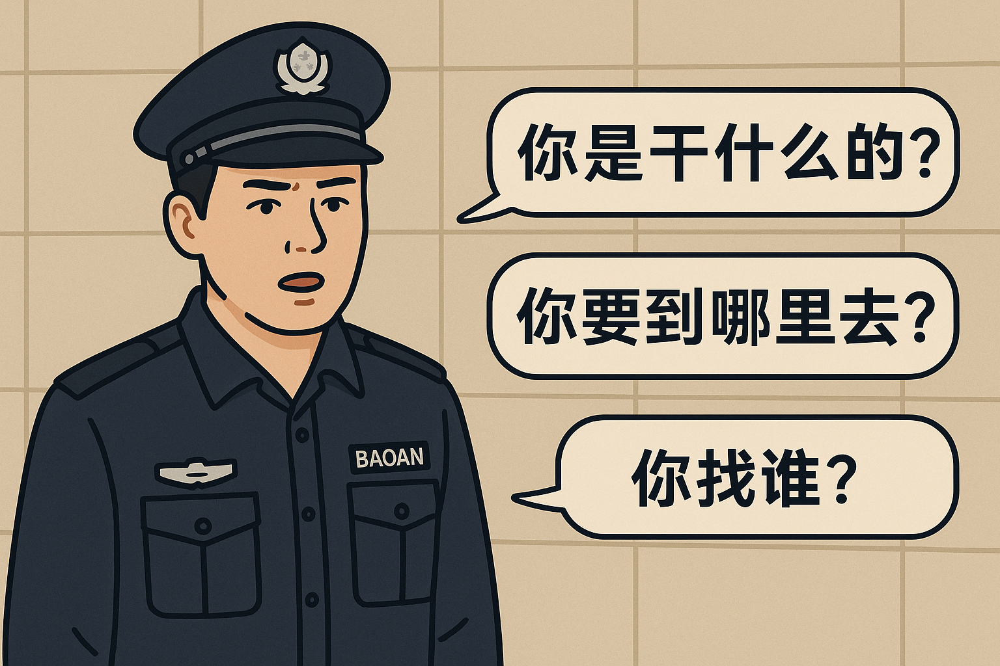

# The ultimate question of philosophy

- Q

```
Where are you from？
Who are you？
Where are you going?
```




- A

    I do not know who I am, so I must embark on a journey to find my true self. 
    When I finally discover who I am, the path I took will become the answer to that question — and by then, I will also know where I am going.

    我不知道我是谁，所以我要踏上寻找真我的旅程，当我知道我是谁的时候，来时的路便是这个问题的答案，届时我也知道我要去哪里
    
    踏上旅程，寻找真我；既知过去，便知未来
